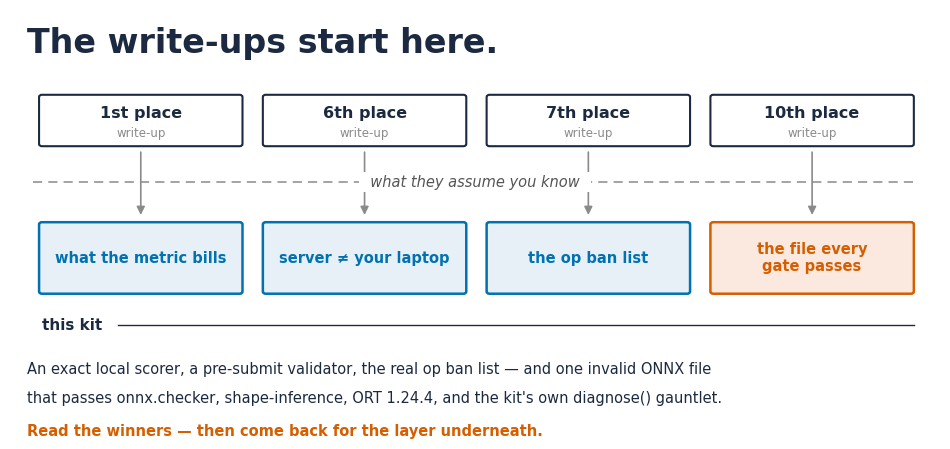
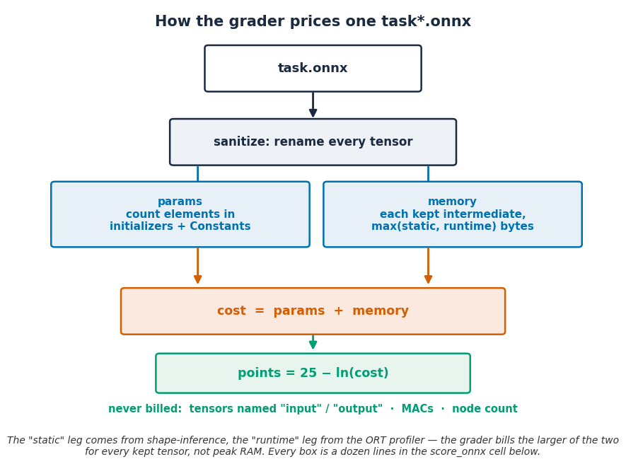

# What every NeuroGolf write-up assumes you know

Разбор-инструментарий [The 2026 NeuroGolf Championship](https://www.kaggle.com/competitions/neurogolf-2026): 400 ARC-задач, на каждую — минимальная ONNX-сеть, счёт `max(1, 25 − ln(params + memory))`. Ноутбук — недостающее вступление к разборам победителей: точный локальный скорер, пре-сабмит валидатор и мифы об запрещённых операторах, проверенные напрямую.

- **Оригинал на Kaggle:** [what-every-neurogolf-write-up-assumes-you-know](https://www.kaggle.com/code/georgymamarin/what-every-neurogolf-write-up-assumes-you-know)
- **Ноутбук в репозитории:** [what-every-neurogolf-write-up-assumes-you-know.ipynb](what-every-neurogolf-write-up-assumes-you-know.ipynb)
- **Тред-компаньон:** [обсуждение в соревновании](https://www.kaggle.com/competitions/neurogolf-2026/discussion/712047)

Что показываю:

- **байт-точная реплика грейдера** — params + memory, где memory считается как max(static, runtime) по каждому хранимому тензору; цена задачи видна до сабмита;
- **Conv-bias, который не ловит ни один стандартный инструмент** — файл с bias короче out_channels проходит onnx.checker, строгий shape-inference и прогон в ORT 1.24.4, а недостающие каналы читают bias из-за границы буфера; статическая проверка в дюжину строк (после обмена находками автор райтапа 6-го места добавил её и в свой гейт);
- **silent zero** — файл, выучивший публичные примеры вместо правила: проходит всё видимое и даёт 0 на скрытом сете; самодостаточная демонстрация на игрушечной задаче;
- **разборы победителей** — райтапы 1/6/7/10 мест, разложенные по частям кита, с дословными цитатами и числами: architectural rewrites у 1-го места давали в среднем +0.5 очка на задачу против +0.05 у полировки.

Оговорка про выводы ячеек: эта копия исполнена локально на пиненом стеке соревнования (onnx 1.21.0, onnxruntime 1.24.4). Значение, прочитанное из-за границы bias-буфера, меняется от прогона к прогону — в этом и суть демонстрации, поэтому числа в ячейке conv-bias отличаются от опубликованного рендера. Канонический рендер — на Kaggle.

   
  

