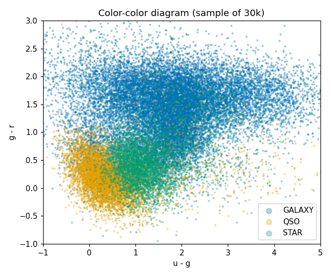
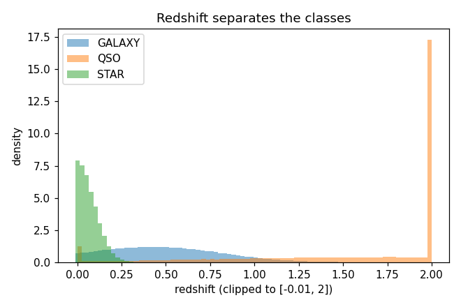

# Stellar Class EDA: which class breaks your score

Разбор Playground S6E6 «Predicting Stellar Class»: по горстке чисел о яркости определить, что за объект — звезда, галактика или квазар. Обучающий EDA от сырого света до честного leak-free baseline.

**Оригинал:** https://www.kaggle.com/code/georgymamarin/an-almost-exhaustive-stellar-class-eda-final · Notebook 🥉

Что показываю:
- **color-color разделение** классов (u−g vs g−r) — три популяции расходятся ещё до модели;
- **ловушка высокого MI** — фича с высоким mutual information и нулевым приростом;
- **leak-free стратифицированная CV**, матрица ошибок на границе GALAXY↔QSO, LightGBM-baseline.

   
  

